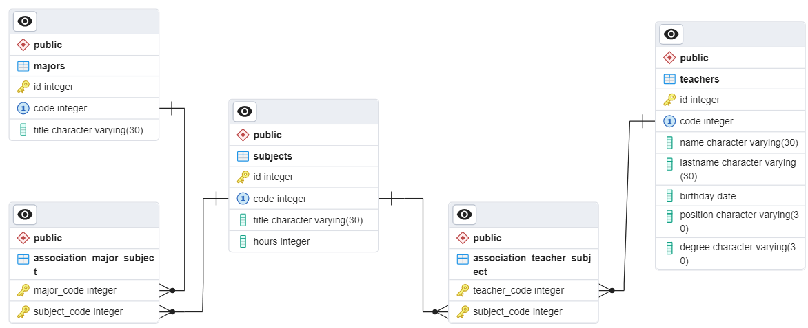

# Приложение для работы с бд «Учебный процесс»

` python`	 ` SQLAlchemy` 	` PYQT5` 

## Задача

- Составить базу данных «Учебный процесс».
- Заполнить таблицы записями.
- Создать пользовательский интерфейс.

## Схема базы данных



## Структура проекта

```sh
project
|-forms
| |-main_forms – основные формы
| |-dialogs – диалоговоые формы
| └-styles – .css файлы стилей форм
|-src – файлы работы с бд: модель бд и менеджер
|-main.py – файл запуска приложения
```

